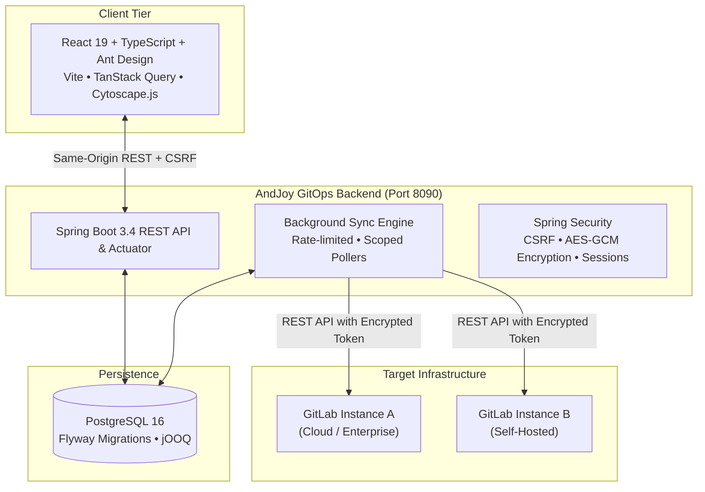

<div align="center">
  

  # AndJoy GitOps

  **The modern, self-hosted operations dashboard for GitLab delivery, pipeline observability, and team analytics.**

  [](https://github.com/andjoy404/anjoy-gitops/actions/workflows/ci.yml)
  [](backend/pom.xml)
  [](backend/pom.xml)
  [](frontend/package.json)
  [](frontend/package.json)
  [](docker-compose.yml)
  [](docker-compose.yml)
  [](LICENSE)

  [✨ Features](#-key-features) • [🚀 Quick Start](#-quick-start) • [🏛 Architecture](#-architecture) • [📖 Documentation](#-documentation) • [🤝 Contributing](CONTRIBUTING.md)
</div>

---

## 🌟 Key Features

**AndJoy GitOps** unifies delivery metrics across multiple GitLab instances into an ultra-fast, theme-aware operations control plane. Monitor deployment velocity, runner availability, contributor activity, and project dependencies in real-time.

| Feature | Description |
|---|---|
| 📊 **Unified Analytics** | Aggregated pipeline volume, success/failure ratios, durations, and delivery trends across monitored groups. |
| ⚡ **Pipeline Operations** | Full pipeline runs history, stage-level job DAG graphs, execution logs, artifact downloads, and retry/cancel actions. |
| 🏃 **Runner Fleet Management** | Real-time availability tracking, active job assignments, executor tags, and version inventories. |
| 👥 **User Contribution Analytics** | Leaderboards for pushes, merge requests, review comments, and issue interactions with CSV exports. |
| 🕸 **Relations Map** | Interactive force-directed Cytoscape graph tracing entity relationships from groups and projects to branches, pipelines, and jobs. |
| 🛡 **Multi-Tenant Isolation** | Namespace-isolated configuration routing, encrypted GitLab access tokens (AES-GCM-256), and session-based RBAC. |

---

## 🏛 Architecture



---

## 🚀 Quick Start

### Prerequisites

- **Docker Engine** & **Docker Compose v2**
- A **GitLab Personal / Project Access Token** with `read_api` permission (or `api` if triggering pipeline actions)

### 1. Clone & Configure

```bash
git clone https://github.com/andjoy404/anjoy-gitops.git
cd andjoy-gitops

# Create production environment configuration
cp .env.example .env

# Generate a 64-character hex key for token encryption
openssl rand -hex 32
```

Update `.env` with your secure credentials:
```env
DB_PASSWORD=your_secure_db_password
ENVIRONMENT_TOKEN_ENCRYPTION_KEY=your_generated_64_hex_character_key
```

### 2. Start Services

```bash
# Using the helper script
./run.sh up

# Or directly with Docker Compose
docker compose up --build -d
```

Open [http://localhost:8090](http://localhost:8090) in your browser.

> [!NOTE]
> **Initial Login**: Sign in with `admin` / `admin`. You will be prompted to set a new password on your first sign-in.

### 3. Connect a GitLab Environment

1. Navigate to **Settings → Environments** in the sidebar.
2. Click **Add Environment**.
3. Provide your GitLab instance base URL (e.g. `https://gitlab.com`), access token, and group IDs to track.
4. Select the environment in the sidebar to begin automated analytics synchronization.

---

## 🛠 Management & CLI

The included `run.sh` script provides shortcuts for common lifecycle tasks:

```bash
./run.sh up         # Build and start services in the background
./run.sh logs       # Tail application container logs
./run.sh status     # Check container status and health
./run.sh restart    # Rebuild and restart application containers
./run.sh down       # Gracefully stop containers (preserves DB volume)
./run.sh clean      # Purge stopped containers, dangling images, and volumes
```

---

## ⚙️ Key Configuration Parameters

All runtime settings are configurable via environment variables in `.env`:

| Variable | Default | Purpose |
|---|---|---|
| `APP_PORT` | `8090` | Web dashboard & API listening port |
| `DB_NAME` | `gitlab_ops` | PostgreSQL database name |
| `ENVIRONMENT_TOKEN_ENCRYPTION_KEY` | *Required* | 256-bit AES hex key for GitLab token encryption |
| `SESSION_SECURE` | `false` | Set to `true` when serving behind HTTPS |
| `ANALYTICS_SYNC_INTERVAL_SECONDS` | `60` | Cadence for background GitLab data sync |
| `ANALYTICS_RETENTION_DAYS` | `30` | Data retention cutoff for user events |
| `PIPELINE_HISTORY_DAYS` | `90` | Days of pipeline history collected on first sync |

See the full [Configuration Reference](docs/reference/configuration.md) for advanced tuning.

---

## 🧪 Development & Testing

### Local Toolchain

- **Backend**: Java 21 LTS, Maven 3.9+, PostgreSQL 16
- **Frontend**: Node.js 22 LTS, npm

```bash
# Frontend development
cd frontend
npm ci
npm run dev        # Dev server with proxy to backend

# Run frontend tests
npm test

# Backend tests
mvn -f backend/pom.xml test
```

For complete local setup, see the [Development Guide](docs/development.md).

---

## 📖 Documentation Index

- [Architecture Overview](docs/architecture/overview.md)
- [Code Map](docs/architecture/code-map.md)
- [GitLab Integration Details](docs/architecture/gitlab-integration.md)
- [Operations & Monitoring](docs/operations/monitoring.md)
- [Backup & Disaster Recovery](docs/operations/backup-restore.md)
- [Security Operations](docs/operations/security.md)
- [Troubleshooting Runbook](docs/operations/troubleshooting.md)

---

## 🛡 Security

To report security vulnerabilities, please refer to [SECURITY.md](SECURITY.md). Never post credentials, tokens, or security bugs in public issues.

---

## 📄 License

Licensed under the [Apache License, Version 2.0](LICENSE). Third-party components remain subject to their respective licenses.

*AndJoy GitOps is an independent project and is not affiliated with or endorsed by GitLab Inc.*
