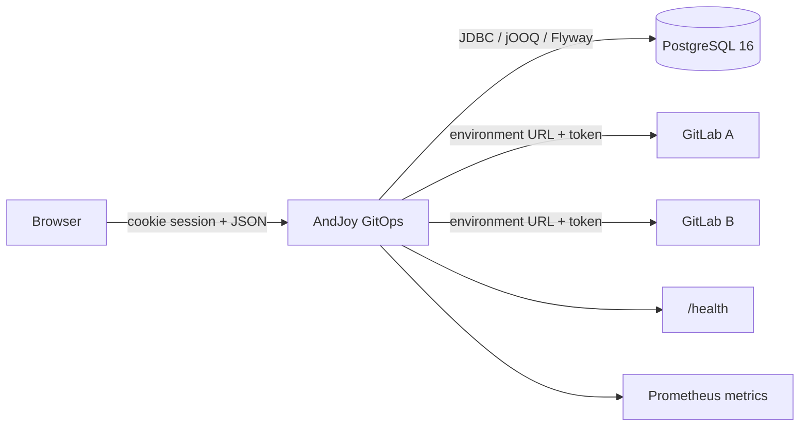

# Architecture overview

AndJoy GitOps is a self-hosted modular monolith: a React single-page application and a Spring Boot API are delivered as one container and use PostgreSQL for configuration and analytics.

## Runtime

- The React SPA and `/api/*` endpoints share one origin and port.
- Spring Boot serves the compiled frontend from embedded static resources.
- Default Compose includes PostgreSQL and a persistent named volume.
- External PostgreSQL is supported through database environment variables.
- GitLab connections are configured per environment and routed with that environment's URL and encrypted token.

## Build

1. Node 22 builds the React/Vite frontend.
2. Maven with Java 21 builds Spring Boot and embeds the frontend.
3. Eclipse Temurin Java 21 JRE runs the application as a non-root user.

## Data and identity boundaries

- Native IDs are sent to GitLab APIs.
- Environment-scoped/internal IDs isolate database rows and frontend caches.
- Tokens are encrypted with AES-256-GCM before persistence.
- Synchronization writes PostgreSQL snapshots that the UI reads independently of GitLab latency.

## Security boundaries

- Cookie sessions and CSRF validation
- Admin/editor authorization
- Forced initial password change
- Encrypted GitLab tokens
- Secure headers and login throttling
- Non-root container with a read-only filesystem

Continue with [frontend](frontend.md), [backend](backend.md), [database](database.md), [synchronization](synchronization.md), and [authentication](authentication.md).
